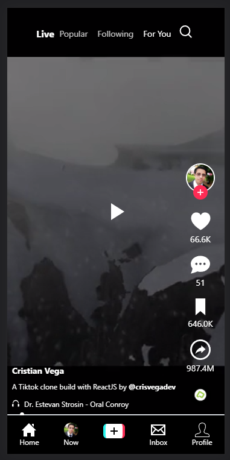

# TikTok Clone

This is a solution to the TikTok Clone. for a Platzi challenge.

## Table of contents

- [Overview](#overview)
  - [The challenge](#the-challenge)
  - [Screenshot](#screenshot)
  - [Links](#links)
- [My process](#my-process)
  - [Built with](#built-with)
- [Author](#author)

## Overview

Users should be able to:
- Play/Pause the video
- View the progress of the video
- View the number of likes, comments, shares and saves
- View the profile image, username, and description of the video
- View comments of vide
- Share video on mobile view
- Implemented API to fetch videos
- Add an interactive slider to view and forward/backward the video
- Add a inifinite scroll to load more videos
- Profile page
- Tags page

### Screenshot

### Links

<!-- - Solution URL: [Repository](https://github.com/crisvegadev/fm-rock-paper-scissors-game) -->
- Live Site URL: [Demo](https://tiktok.crisvega.dev/)

## My process

### Built with

- Semantic HTML5
- CSS custom properties
- TailwindCSS
- Flexbox
- Mobile-first workflow
- [React](https://reactjs.org/)

## Author

- Website - [crisvega.dev](https://crisvega.dev/)
- Twitter - [@crisvegadev](https://www.twitter.com/crisvegadev)
- LinkeIn - [@crisvegadev](https://www.linkedin.com/in/crisvegadev)
